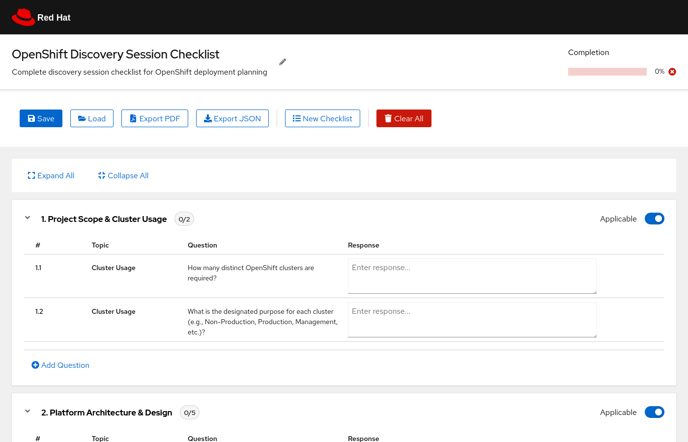
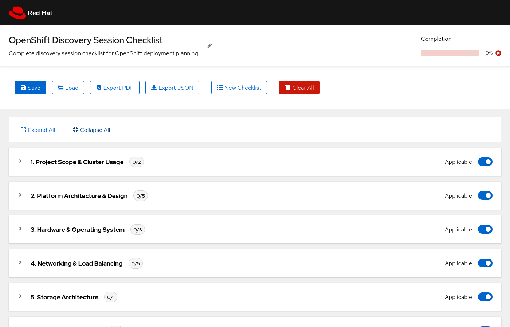

# OpenShift Discovery Session Tool

A modern, interactive web-based checklist tool for conducting OpenShift discovery sessions. Built with **React**, **TypeScript**, and **PatternFly** (Red Hat's design system), it helps teams systematically gather and document requirements for OpenShift deployments.



---

## Live Demo

Try the tool instantly without installing anything:

**https://yakovbeder.github.io/discovery-session-tool/**

> **Note:** The live demo is for demonstration/presentation purposes only. Data is stored in your browser's local storage and is not shared with a server, but anyone using the same browser profile on the same machine will see the same data.

---

## Quick Start

### Prerequisites

You need **Node.js** (version 18 or newer) installed on your machine. Node.js includes **npm** (the package manager) automatically.

**Install Node.js:**

- **RHEL / Fedora / CentOS:**
  ```bash
  sudo dnf install -y nodejs
  ```
- **Ubuntu / Debian:**
  ```bash
  sudo apt update && sudo apt install -y nodejs npm
  ```
- **macOS (with Homebrew):**
  ```bash
  brew install node
  ```
- **Any OS (official installer):** Download from https://nodejs.org (choose the LTS version)

Verify the installation:
```bash
node --version    # should show v18.x or higher
npm --version     # should show 9.x or higher
```

### Run the tool

```bash
# 1. Clone the repository
git clone https://github.com/yakovbeder/discovery-session-tool.git
cd discovery-session-tool

# 2. Start the tool (installs dependencies automatically on first run)
./start.sh
```

Open **http://localhost:8000** in your browser.

That's it. The `start.sh` script handles everything: it checks for dependencies, installs them if needed, and starts the development server.

### Manual setup (alternative)

If you prefer to run the commands yourself:

```bash
git clone https://github.com/yakovbeder/discovery-session-tool.git
cd discovery-session-tool
npm install          # install dependencies (only needed once)
npm run dev          # start the development server
```

### Build for production

To create optimized static files for hosting:

```bash
npm run build
```

The output goes to `dist/`. You can serve it with any web server (nginx, Apache, GitHub Pages, etc.).

---

## Features

### Checklist with collapsible sections

Each of the 10 predefined sections can be expanded or collapsed. Use **Expand All** / **Collapse All** for quick navigation. Click anywhere on the section title or the toggle arrow to expand.



### Per-section progress tracking

Each section shows a badge indicating how many questions have been answered (e.g., `3/5`). A green checkmark appears when all questions in a section are complete. The overall progress bar at the top stays **sticky** as you scroll.

### Mark sections as Not Applicable

Toggle the **Applicable / Skipped** switch on any section to exclude it from the progress bar. Skipped sections are visually dimmed and marked clearly.

### Add custom sections and questions

- Click **Add Question** at the bottom of any section to add a new question with an auto-generated number
- Click **Add Section** at the bottom of the page to create entirely new sections
- Custom items are fully integrated: they appear in exports, receive automatic numbering, and persist across sessions

### Dynamic numbering

All section and question numbers are computed from position, not hardcoded. Adding, removing, or reordering items keeps numbering consistent everywhere -- in the app and in exports.

### Responsive layout

The interface adapts to screen size. On desktop, questions are displayed in a table layout. On mobile and tablets, they switch to a stacked card layout.

### Branded PDF export

Export a professional, print-ready PDF with Red Hat branding. The PDF includes a branded header, progress summary, all sections and responses, and proper handling of skipped sections.

### Data persistence and portability

| Action | What it does |
|--------|-------------|
| **Save** | Writes to browser `localStorage` -- survives page reloads |
| **Load** | Imports a previously exported `.json` file |
| **Export JSON** | Downloads all data as a portable `.json` file |
| **Export PDF** | Opens a branded print preview for saving as PDF |
| **Clear All** | Resets everything (with confirmation) |

### Keyboard shortcuts

| Shortcut | Action |
|----------|--------|
| `Ctrl/Cmd + S` | Save to localStorage |
| `Ctrl/Cmd + O` | Load from JSON file |
| `Ctrl/Cmd + P` | Export to PDF |

---

## Sections Covered

| # | Section | Topics |
|---|---------|--------|
| 1 | Project Scope & Cluster Usage | Number of clusters, cluster purposes |
| 2 | Platform Architecture & Design | Installation method, OCP version, node composition, HA & etcd |
| 3 | Hardware & Operating System | Hardware growth, RHCOS, bastion RHEL version |
| 4 | Networking & Load Balancing | SDN/CIDR, DNS, ingress/TLS, load balancing, egress |
| 5 | Storage Architecture | NetApp, ODF, S3 compatibility |
| 6 | Security & Compliance | Authentication, authorization, network policies, hardening, ACS, service mesh |
| 7 | Image Management | Connected/disconnected, registry strategy |
| 8 | Observability | Monitoring, logging (Loki/Vector), tracing (Tempo/Jaeger) |
| 9 | Platform Operations & Lifecycle | Node management, upgrades, NTP, backup/restore |
| 10 | Automation & Integration | CI/CD tools, GitOps, ACM |

All sections are customizable -- add your own sections and questions directly from the UI.

---

## Tech Stack

| Layer | Technology |
|-------|------------|
| Framework | React 18 + TypeScript |
| UI library | PatternFly 5 (Red Hat design system) |
| Build tool | Vite |
| State | React hooks with debounced localStorage sync |
| PDF export | Browser print API with branded HTML template |

## Project Structure

```
discovery-session-tool/
├── index.html                  # Vite entry point
├── package.json                # Dependencies and scripts
├── vite.config.ts              # Vite configuration
├── tsconfig.json               # TypeScript configuration
├── start.sh                    # Quick start script
├── server.py                   # Optional Python static server
├── public/
│   └── redhat-logo.svg         # Red Hat logo for masthead
├── src/
│   ├── main.tsx                # App entry point + PatternFly CSS import
│   ├── App.tsx                 # Root component (modals, shortcuts, layout)
│   ├── App.css                 # Custom styles (sticky header, animations)
│   ├── data/
│   │   └── checklist.ts        # Section/question definitions (single source of truth)
│   ├── hooks/
│   │   └── useChecklistState.ts  # State management, persistence, CRUD
│   ├── components/
│   │   ├── ProgressHeader.tsx  # Sticky progress bar
│   │   ├── ChecklistToolbar.tsx  # Action buttons
│   │   └── ChecklistView.tsx   # Collapsible cards, table/mobile layouts
│   └── utils/
│       └── export.ts           # JSON download and branded PDF generation
└── docs/
    └── screenshots/            # README screenshots
```

## Data Format

The tool uses a backward-compatible JSON format for import/export:

```json
{
  "timestamp": "2026-03-03T18:00:00.000Z",
  "version": "2.0",
  "sections": {
    "1.1": { "response": "3 clusters" },
    "1.2": { "response": "Production, Staging, Management" }
  },
  "customSections": [],
  "customQuestions": {},
  "skippedSections": ["5.0"]
}
```

Files exported from the old v1.0 tool can be imported into this version.

---

## Contributing

1. Fork the repository
2. Create a feature branch
3. Make your changes and verify with `npm run build`
4. Submit a pull request

## License

MIT

---

**Note**: This tool is designed for OpenShift discovery sessions and follows Red Hat's best practices for OpenShift deployment planning.
